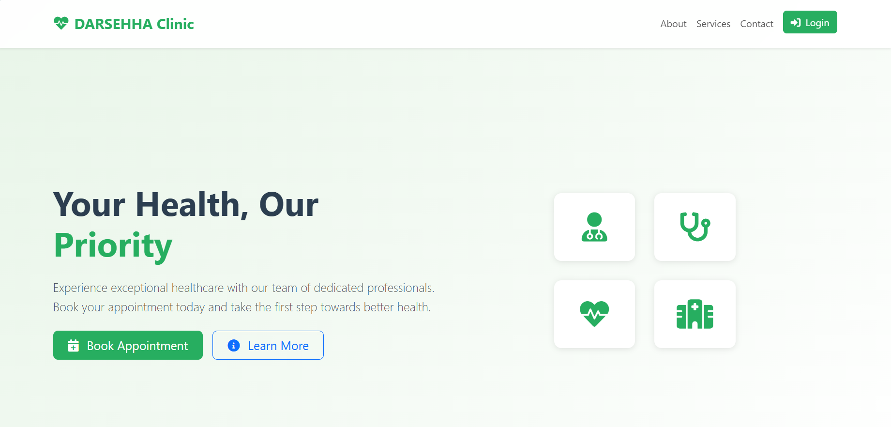
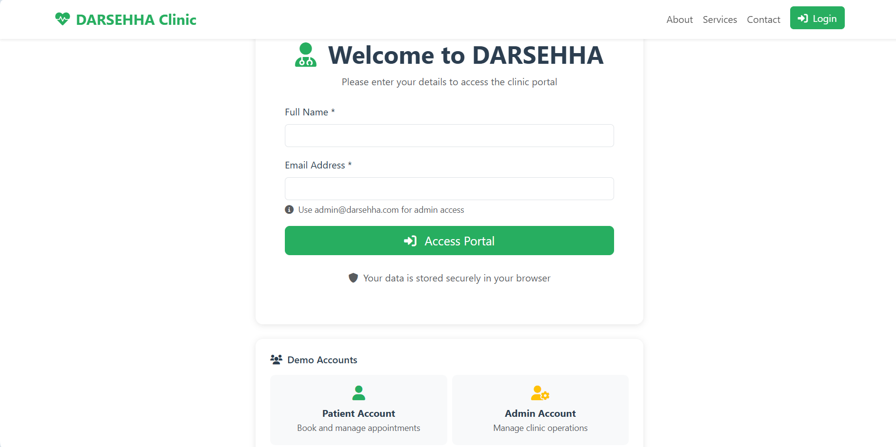
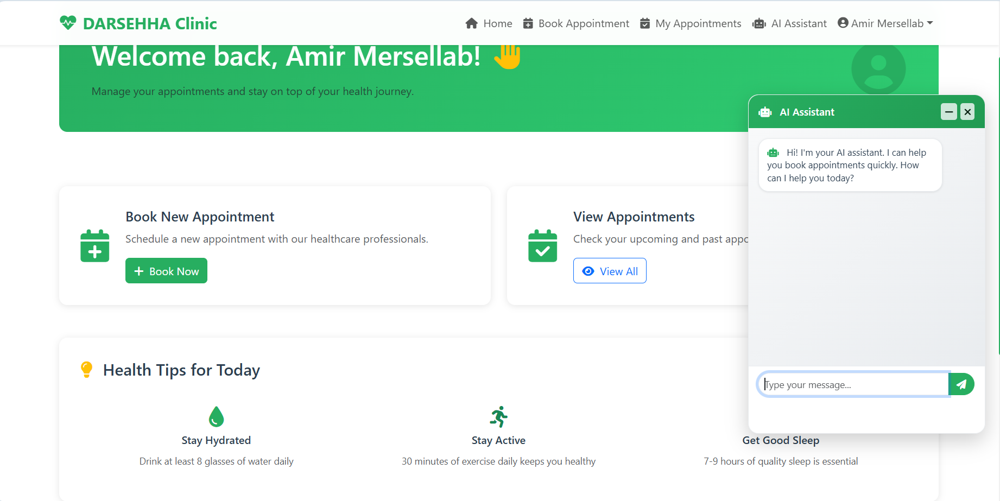
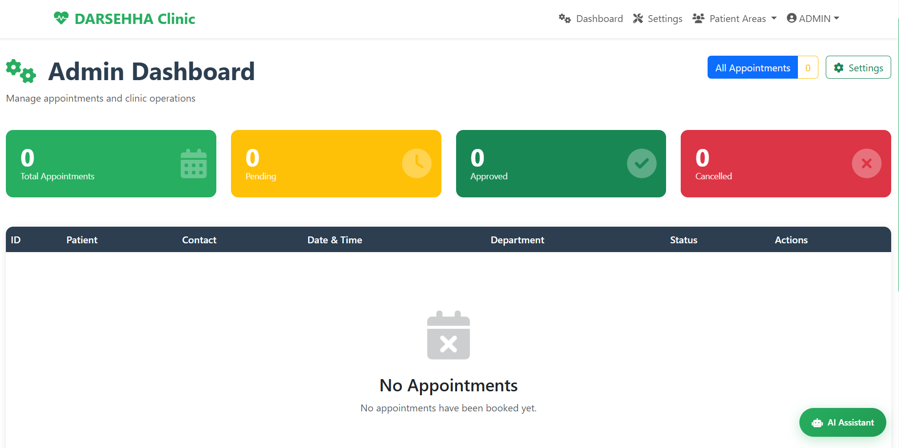

# 🏥 DARSEHHA Clinic Project

<p align="center">
  
</p>

<p align="center">
  <a href="#-technologies"></a>
  <a href="#-technologies"></a>
  <a href="#-license"></a>
  <a href="https://github.com/mrvoidx/appointment-clinic/commits/main"></a>
  
</p>

---

## 🧾 Overview

**Appointment Clinic Project** is a web-based healthcare management system built with **Flask**.  
It is designed to help clinics manage their operations, provide patient interaction tools, and offer an integrated **AI-powered chatbot** to assist patients with inquiries.  

This project can be used for:  
- Managing appointments  
- Providing clinic information  
- Offering chatbot-based guidance  
- Serving as a base for healthcare-related web applications  

---

## 🚀 Features

1. **Patient Management System**  
   - Patients can interact with the platform via a user-friendly interface.  
   - Provides access to clinic services and information.  

2. **AI Chatbot**  
   - Integrated chatbot (`chatbot.py`) for answering patient queries.  
   - Can be customized with medical FAQs or guidance.  

3. **Web-based Interface**  
   - Built with **Flask** and **Jinja2 templates** (`templates/` folder).  
   - Static assets (`static/`) for CSS, JS, and images.  

4. **Scalable Deployment**  
   - Run locally with `python main.py`.  
   - Deploy in production with **Gunicorn**.  

5. **Easy Setup**  
   - Minimal dependencies.  
   - Works across platforms (Windows, Linux, macOS).  

---

## 📸 Screenshots

### 🏠 Homepage
The landing page introduces the clinic, highlights available services, and allows patients to **book an appointment** directly.  



---

### 🔐 Login Portal
Secure login for **patients** and **admins**.  
- Patients can book and manage appointments.  
- Admins can access clinic operations.  



---

### 👨‍⚕️ Patient Dashboard
After login, patients can:  
- Book new appointments.  
- View upcoming or past appointments.  
- Receive **daily health tips**.  
- Chat with the integrated **AI Assistant**.  



---

### 🛠️ Admin Dashboard
Admins have access to a management panel where they can:  
- Track all appointments (pending, approved, canceled).  
- Manage patient records.  
- Control clinic operations.  



---

## 🛠️ Installation

```bash
# Clone the repository
git clone https://github.com/mrvoidx/appointment-clinic.git

# Navigate into the project folder
cd appointment-clinic

# Install dependencies
pip install -r dependencies_list.txt

# Run the application
python main.py

# Or (Windows alternative)
py -m pip install -r dependencies_list.txt
py main.py
```

---

## ⚡ Usage

1. Start the Flask server:  
   ```bash
   python main.py
   ```

2. Open your browser and navigate to:  
   👉 http://127.0.0.1:5000  

3. Interact with:  
   - Web dashboard  
   - Chatbot assistant  
   - Clinic information pages  

4. (Optional) For production, use Gunicorn:  
   ```bash
   gunicorn --bind 0.0.0.0:5000 main:app
   ```

---

## 📂 Project Structure

```
DARSEHHA-Clinic/
│── app.py               # Core Flask application
│── main.py              # Entry point to run the server
│── routes.py            # Application routes & endpoints
│── chatbot.py           # Chatbot logic & AI assistant
│── dependencies_list.txt# Project dependencies
│── RUN.txt              # Run instructions
│── templates/           # Jinja2 HTML templates
│── static/              # CSS, JS, images
│── screenshots/         # Project screenshots
│── __pycache__/         # Compiled Python cache files
```

---

## 📦 Technologies

- **Python 3.10+**
- **Flask 2.3.3**
- **Gunicorn 21.2.0**
- HTML5, CSS3, JavaScript (frontend)  

---

## 🤝 Contributing

Contributions are welcome! 🚀  

1. Fork the repository  
2. Create a feature branch (`git checkout -b feature/my-feature`)  
3. Commit your changes (`git commit -m 'Add my feature'`)  
4. Push to the branch (`git push origin feature/my-feature`)  
5. Open a Pull Request  

---

## 📜 License

MIT License © 2025 MrVoidx.  

Permission is hereby granted, free of charge, to any person obtaining a copy  
of this software and associated documentation files (the “Software”), to deal  
in the Software without restriction, including without limitation the rights  
to use, copy, modify, merge, publish, distribute, sublicense, and/or sell  
copies of the Software, and to permit persons to whom the Software is  
furnished to do so, subject to the following conditions:  

The above copyright notice and this permission notice shall be included in  
all copies or substantial portions of the Software.  

THE SOFTWARE IS PROVIDED “AS IS”, WITHOUT WARRANTY OF ANY KIND, EXPRESS OR  
IMPLIED, INCLUDING BUT NOT LIMITED TO THE WARRANTIES OF MERCHANTABILITY,  
FITNESS FOR A PARTICULAR PURPOSE AND NONINFRINGEMENT. IN NO EVENT SHALL THE  
AUTHORS OR COPYRIGHT HOLDERS BE LIABLE FOR ANY CLAIM, DAMAGES OR OTHER  
LIABILITY, WHETHER IN AN ACTION OF CONTRACT, TORT OR OTHERWISE, ARISING  
FROM, OUT OF OR IN CONNECTION WITH THE SOFTWARE OR THE USE OR OTHER DEALINGS  
IN THE SOFTWARE.  
